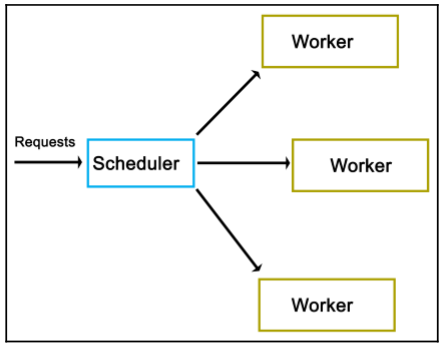

## Multi-thread-synchronization-using-scheduler-model
Advance multi-thread synchronization using async scheduler model

# About
  Threads are used to work on a task more or less independently from other threads, there are many occasions where one would want to pass data between threads, or even control other threads, such as from a central task scheduler thread.  And major problem with concurrency is that of ensuring safe access to shared resources even when communicating between threads. And thread synchronization and communication becomes a problem.
There are many approaches to handle these problems. Th goal here is assign a incoming task/request to a thread as soon as possible. A common error in most of the solution is that often one has worker threads running in an active loop, constantly polling a central queue for new tasks. Disadvantages of this approach include wasting of processor cycles on the said polling, and the congestion which forms at the synchronization mechanism used, generally a mutex. Furthermore, this active polling approach scales very poorly when the number of worker threads increase.

# High-level view

  In the attached solution, I have a scheduler that maintains a pool of worker and queue of waiting jobs to be taken up by works threads.  Scheduler dispatches incoming task/request to one of the worker threads and if no worker threads is available then the task in added to the waiting job queue.
Once a worker threads finishes processing the request, it checks the waiting job queue to take up another request to process. Here, worker threads do not poll for the job queue rather they are being notified once a new job has come to process. 

